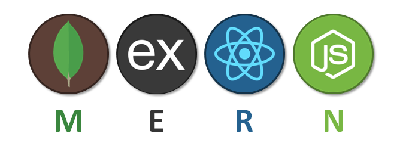

# MongoDB / MySql & Firebase


goor


#### hello

hi




hello






valo asis vai




<figure><figcaption><p>good</p></figcaption></figure>

<details>

<summary>helo</summary>


</details>

| hello |   |   |
| ----- | - | - |
|       |   |   |
|       |   |   |
|       |   |   |



```
// Some code
```










